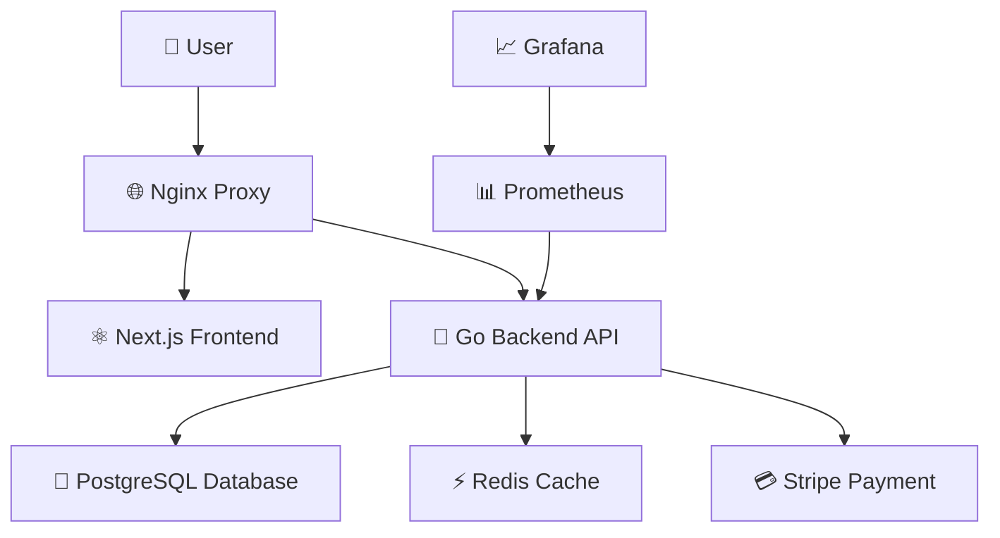

# 🚀 Eshop

<div align="center">


**Complete Eshop - ready-to-customize template for developers**

[](#-documentation)
[](#quick-start)

</div>

---

## ✨ Why This Skeleton?

### 🎯 **Ready-to-Customize Template**
- **Full-featured backend API** out of the box
- **Clean architecture** with layered separation
- **Pre-built data models** for Eshop
- **Smart image system** with automatic placeholders
- **Admin panel** for easy management
- **Well-documented code** for easy understanding

### ⚡ **High Performance**
- **Microservice architecture** for scalability
- **Optimized database queries**
- **Middleware** for logging and monitoring
- **WebSocket** support for real-time features
- **Image optimization** with Next.js Image component
- **Caching system** with Redis integration

### 🔒 **Security & Reliability**
- **JWT authentication** with refresh tokens
- **CORS** configuration
- **Rate limiting** DDoS protection
- **Data validation** at all levels
- **Secure file uploads** with type validation
- **Error handling** with graceful fallbacks

### 💳 **Payment System**
- **Stripe integration** ready to configure
- **Webhook handling** for synchronization
- **Multi-currency** support
- **Automatic refunds** and reimbursements

---

## 🏗️ Architecture



### 🎨 **Frontend (Next.js 14)**
- **App Router** with Server Components
- **Tailwind CSS** for styling
- **TypeScript** for type safety
- **Ready-to-customize skeleton** for rapid development

### 🔧 **Backend (Go + Gin)**
- **RESTful API** with full documentation
- **Middleware** for authentication and logging
- **Repository Pattern** for data access
- **WebSocket** for real-time notifications

### 🗄️ **Database (PostgreSQL)**
- **Normalized schema** for data integrity
- **Indexes** for fast queries
- **Migrations** for schema versioning
- **Backup** and recovery

---

## 🚀 Quick Start

### 📋 Requirements
- **Docker** 20.10+
- **Docker Compose** 2.0+
- **Make** (optional)

### ⚡ Launch in 1 command

```bash
git clone https://github.com/JIIL07/Eshop
cd Eshop

make start-full
```

**Or step by step:**

```bash
make setup
make dev
make auto-init
```

### 🌐 Access to services
- **Frontend**: http://localhost:3000
- **Backend API**: http://localhost:5000
- **API Documentation**: http://localhost:5000/docs (Swagger)
- **Admin Panel**: http://localhost:5000/admin
- **Nginx**: http://localhost:80
- **Grafana**: http://localhost:3001
- **Prometheus**: http://localhost:9090

---

## 👨‍💻 For Developers

### 🎯 **What You Get**
This skeleton provides you with a **complete Eshop platform** with backend and frontend that you can:

- **Customize to your needs** - change design, add new features
- **Launch quickly** - ready-to-work online store out of the box
- **Scale easily** - add microservices, caching, queues
- **Customize business logic** - modify workflows, add new payment systems

### 🚀 **Development Quick Start**

1. **Explore the platform**:
- Open http://localhost:3000 for frontend
- Open http://localhost:5000/docs for API documentation
- Open http://localhost:5000/admin for admin panel
- Test endpoints with Postman/Insomnia

2. **Customize for yourself**:
- Change design in `frontend/src/`
- Modify models in `backend-go/internal/models/`
- Add new endpoints in `backend-go/internal/handlers/`
- Configure business logic in `backend-go/internal/services/`
- Upload images through `/api/uploads`
- Manage products via admin panel at `/admin`

### 📁 **Project Structure**
```
├── backend-go/       # Go Backend API
│   ├── internal/
│   │   ├── handlers/     # HTTP handlers (controllers)
│   │   ├── services/     # Business logic
│   │   ├── repositories/ # Database access
│   │   ├── models/       # Data models
│   │   ├── middleware/   # Middleware (auth, cors, logging)
│   │   ├── utils/        # Utilities (JWT, validation)
│   │   ├── websocket/    # WebSocket system
│   │   └── seeds/        # Database seeding
│   ├── migrations/       # SQL migrations
│   ├── uploads/          # Uploaded files
│   ├── scripts/          # Utility scripts
│   └── templates/        # HTML templates
├── frontend/         # Next.js Frontend
│   ├── src/
│   │   ├── app/         # App Router pages
│   │   ├── components/  # React components
│   │   ├── lib/         # Utilities and API client
│   │   └── hooks/       # Custom hooks
│   └── public/          # Static files
├── nginx/            # Nginx configuration
├── monitoring/       # Prometheus + Grafana
└── docker-compose.yml # Service orchestration
```

### 🔧 **Key Features**
- ✅ **Authentication** - JWT tokens, registration, login
- ✅ **Products** - CRUD operations, categories, search
- ✅ **Shopping Cart** - add/remove products
- ✅ **Orders** - creation, tracking, history
- ✅ **Payments** - Stripe integration
- ✅ **Reviews** - rating and comment system
- ✅ **Wishlist** - favorites functionality
- ✅ **WebSocket** - real-time notifications
- ✅ **Image System** - upload, storage, placeholder fallbacks
- ✅ **Admin Panel** - comprehensive management interface
- ✅ **Monitoring** - Prometheus + Grafana

---

## 🛠️ Main Commands

```bash
# Development
make dev              # Start in development mode
make build            # Build all services
make test             # Run tests

# Database & Seeding
make init             # Initialize database
make seed             # Seed with test data
make generate-images  # Generate placeholder images

# Production
make prod             # Start in production mode
make deploy           # Deploy to server
make backup           # Backup database

# Utilities
make logs             # View logs
make health           # Check service health
make clean            # Clean containers
```

---

## 🖼️ Image System

### **Smart Image Handling**
- **Automatic placeholders** for missing product images
- **Fallback system** with graceful error handling
- **Multiple image formats** support (JPEG, PNG, GIF, WebP)
- **Optimized delivery** through Next.js Image component

### **Features**
- ✅ **Upload system** - secure file upload with validation
- ✅ **Placeholder generation** - automatic creation for seed data
- ✅ **Error handling** - graceful fallbacks for broken images
- ✅ **Responsive images** - different sizes for different components
- ✅ **CDN ready** - easy integration with external image services

### **Quick Setup**
```bash
# Generate placeholder images for all products
make generate-images

# Images will be available at:
# http://localhost:5000/api/uploads/filename.jpg
```

---

## 📊 Monitoring & Analytics

### 📈 **Built-in Analytics**
- **Prometheus** for metrics collection
- **Grafana** for visualization
- **Health checks** for all services
- **Real-time performance monitoring**

### 📋 **Metrics**
- API response time
- Resource usage
- Request count
- Errors and exceptions

---

### 🐳 **Docker Deployment**
```bash
docker compose up -d
```
---

## 🤝 Support & Community

### 💬 **Get Help**
- **GitHub Issues** for bugs and suggestions

### 📚 **Documentation**
- **API Documentation** - Swagger UI available at `/docs`
- **Database Schema** - migrations in `migrations/` folder
- **Image System** - upload, storage, and placeholder handling
---

**⭐ Give us a star if you like the project!**

---

<div align="center">

**Created with ❤️ for Eshop developers**

[](https://github.com/JIIL07/Eshop)

</div>
